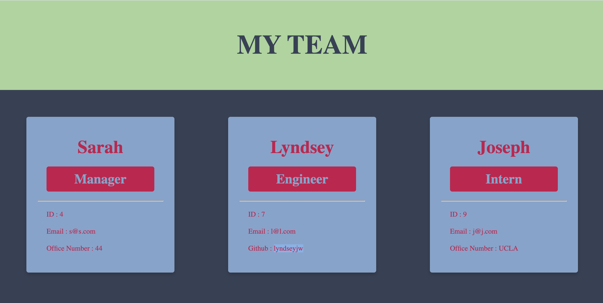
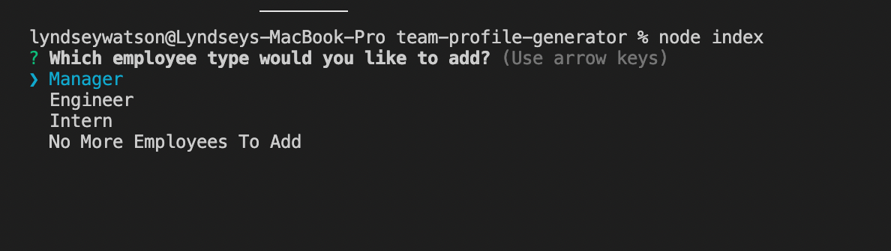
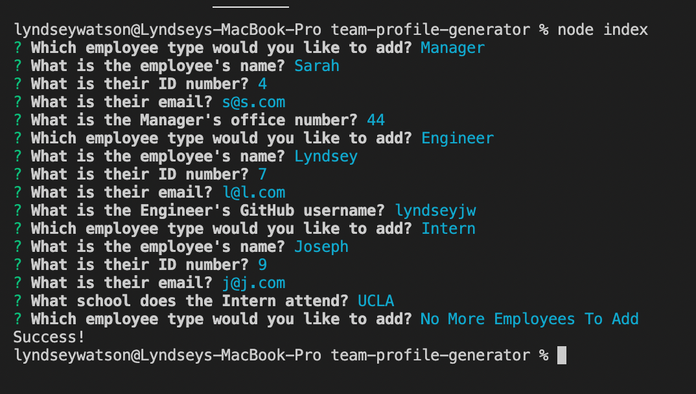
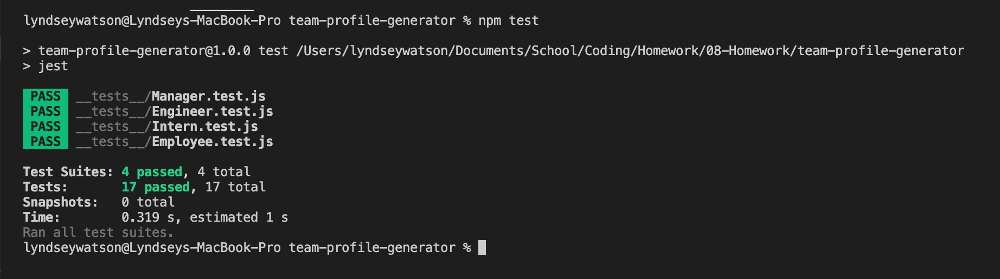

# team-profile-generator

## A Team Profile Generator Using Command Line User Input

Yet another way to save time & energy, I created this application so users can create a stylized HTML file based on questions they answer in the command line. This way users can have a ready to go file in a matter of minutes & have an organized way of logging their teammembers, rather than spending time styling frontend UI.

I thoroughly enjoy styling frontend UI but I have learned how this can also take away from a project if the majority of the work is in backend. More often than not, teams might want to spend the majority of their time working on the functioning of their programming & not have to worry about frontend UI. I have developed this application as a stepping stone to many other applications I plan on developing to reduce the time teams spend on the frontend. Having templates like this where users can input their information, perhaps when creating a portolio, is a great way to show their skills without being docked for a subpar frontend. 

To watch a video of how this application works, I invite you to click here : https://drive.google.com/file/d/1QU9pHj1aj8_JI8I8AZpU6j0NwK66cler/view

Technologies used : HTML5, Advanced CSS, Javascript, Node.

This project is licensed under the terms of the MIT license. You may contact the sole contributor at lyndseyjwatson@gmail.com

I hope you enjoy!

